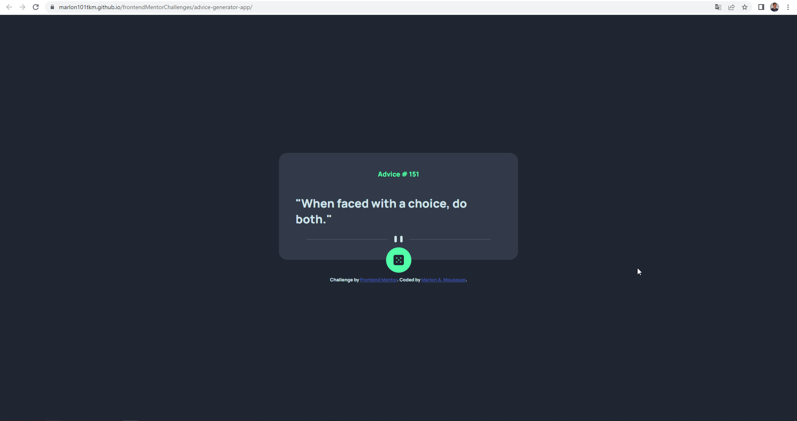
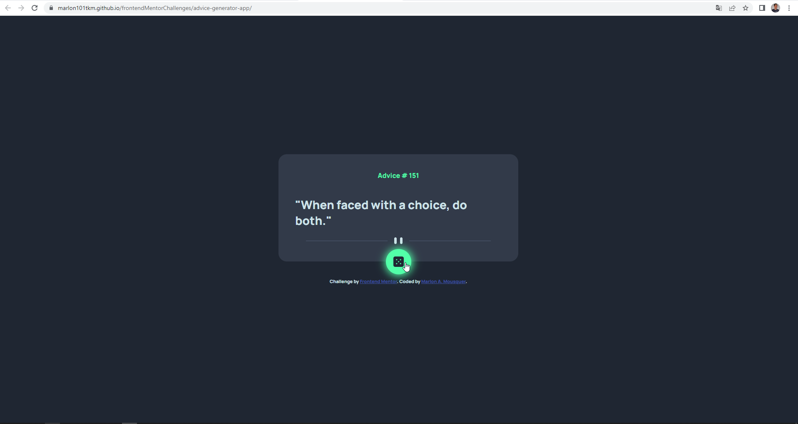

# Frontend Mentor - Advice generator app solution

This is a solution to the [Advice generator app challenge on Frontend Mentor](https://www.frontendmentor.io/challenges/advice-generator-app-QdUG-13db). 

## Table of contents

- [Overview](#overview)
  - [The challenge](#the-challenge)
  - [Screenshot](#screenshot)
  - [Links](#links)
- [My process](#my-process)
  - [Built with](#built-with)
  - [What I learned](#what-i-learned)
  - [Useful resources](#useful-resources)
- [Author](#author)


**Note: Delete this note and update the table of contents based on what sections you keep.**

## Overview

### The challenge

Users should be able to:

- View the optimal layout for the app depending on their device's screen size
- See hover states for all interactive elements on the page
- Generate a new piece of advice by clicking the dice icon

### Screenshot

Static layout


Hover ond dice button


### Links

- Live Site URL: [Advice Generator App](https://marlon101tkm.github.io/frontendMentorChallenges/advice-generator-app/)

## My process

### Built with

- Semantic HTML5 markup
- CSS custom properties
- Flexbox
- JavaScript
- [Advice Slip API](https://api.adviceslip.com) - Phrases generation API


### What I learned
The learning was the basic use of Fetch from JavaScript, to consume an external API

```js
function loadQuote() {
    const quote = document.getElementById('quote');
    const number = document.getElementById('number');
    return fetch('https://api.adviceslip.com/advice')
        .then(data => data.json())
        .then(json => {
            quote.textContent = `"${json.slip.advice}"`;
            number.textContent = `Advice # ${json.slip.id}`;

        })
        .catch(err => console.log('Erro:', err))
}

loadQuote();
```

### Useful resources

- [Fetch Mozila Docs](https://developer.mozilla.org/pt-BR/docs/Web/API/Fetch_API/Using_Fetch) - This helped me to understand how JavaScript's Fetch function works


## Author

- Website - [Marlon Almeida Mousquer](https://marlon101tkm.github.io/mini-portfolio/)
- Frontend Mentor - [@marlon101tkm](https://www.frontendmentor.io/profile/marlon101tkm)
