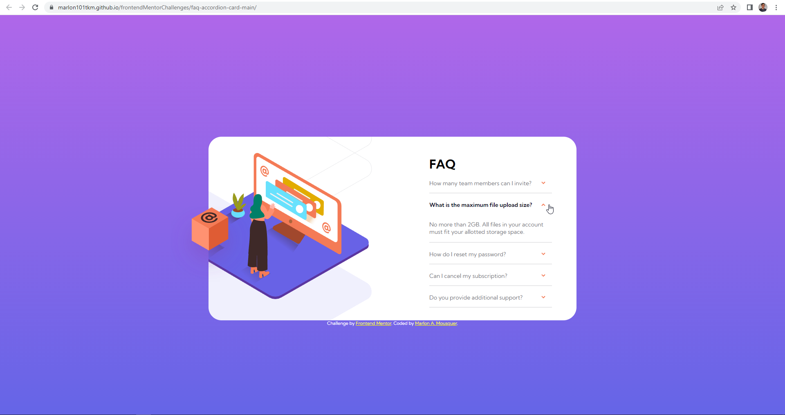

# Frontend Mentor - FAQ accordion card solution

This is a solution to the [FAQ accordion card challenge on Frontend Mentor](https://www.frontendmentor.io/challenges/faq-accordion-card-XlyjD0Oam).

## Table of contents

- [Overview](#overview)
  - [The challenge](#the-challenge)
  - [Screenshot](#screenshot)
  - [Links](#links)
- [My process](#my-process)
  - [Built with](#built-with)
  - [What I learned](#what-i-learned)
  - [Useful resources](#useful-resources)
- [Author](#author)


## Overview

### The challenge

Users should be able to:

- View the optimal layout for the component depending on their device's screen size. 
- See hover states for all interactive elements on the page.
- Hide/Show the answer to a question when the question is clicked.

### Screenshot

Static Layout


Accordeon component open


### Links

- Live Site URL: [Faq Accordion Card](https://marlon101tkm.github.io/frontendMentorChallenges/faq-accordion-card-main/)

## My process

### Built with

- Semantic HTML5 markup
- CSS custom properties
- Flexbox
- JavaScript


### What I learned

The main learning was in using JavaScript in conjunction with CSS to manipulate screen elements.

This is the main function used to handle CSS.
```js
function showAnswer(){
    let classList = this.classList;
    
    let answer = this.parentElement.nextElementSibling;
    let question = this.parentElement.children[0];

    if(classList.contains("icon-up")){
        
        classList.remove("icon-up");
        answer.classList.remove("open");
        question.classList.remove("bold");
    }else{
        classList.add("icon-up");
        answer.classList.add("open");
        question.classList.add("bold");
    }
}

```

These are the main tags used to change page elements.
```css
.icon {
  ...
}

.icon-up {
  ...
}

.answer {
    display: none;
    ...
}

.open {
    display: inherit;
}
```

### Useful resources

- [W3 Schools Accordeon component](https://www.w3schools.com/howto/howto_js_accordion.asp) - This helped me to understand some methods of making an accordion type component.


## Author

- Website - [Marlon Almeida Mousquer](https://marlon101tkm.github.io/mini-portfolio/)
- Frontend Mentor - [@marlon101tkm](https://www.frontendmentor.io/profile/marlon101tkm)