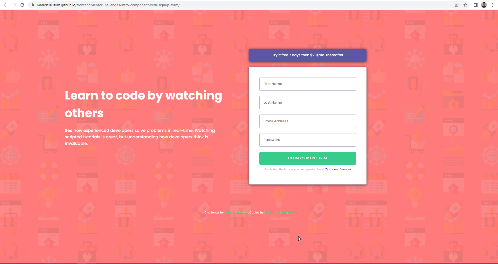
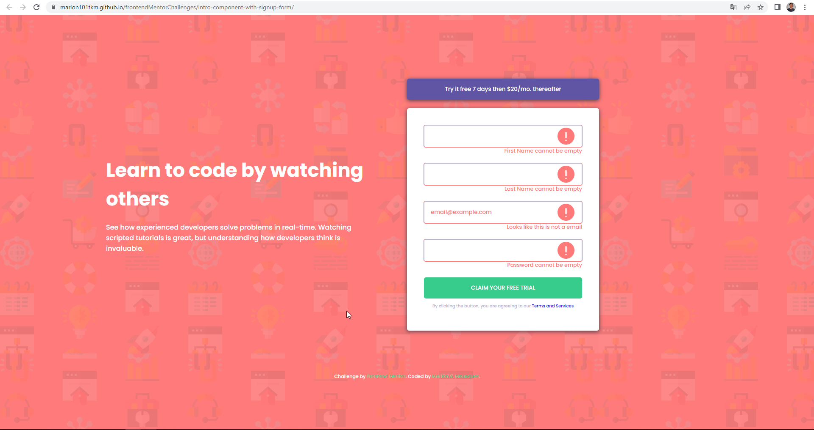

# Frontend Mentor - Intro component with sign up form solution

This is a solution to the [Intro component with sign up form challenge on Frontend Mentor](https://www.frontendmentor.io/challenges/intro-component-with-signup-form-5cf91bd49edda32581d28fd1). 

## Table of contents

- [Overview](#overview)
  - [The challenge](#the-challenge)
  - [Screenshot](#screenshot)
  - [Links](#links)
- [My process](#my-process)
  - [Built with](#built-with)
  - [What I learned](#what-i-learned)
  - [Useful resources](#useful-resources)
- [Author](#author)


## Overview

### The challenge

Users should be able to:

- View the optimal layout for the site depending on their device's screen size.
- See hover states for all interactive elements on the page.
- Receive an error message when the `form` is submitted if:
  - Any `input` field is empty. The message for this error should say *"[Field Name] cannot be empty"*
  - The email address is not formatted correctly (i.e. a correct email address should have this structure: `name@host.tld`). The message for this error should say *"Looks like this is not an email"*

### Screenshot

Static Layout



Error messages showing validation of empty and email checking fields



### Link

- Live Site URL: [Intro component with signup form](https://marlon101tkm.github.io/frontendMentorChallenges/intro-component-with-signup-form/)

## My process

### Built with

- Semantic HTML5 markup
- CSS custom properties
- Flexbox
- JavaScript 

### What I learned

I was able to learn how to do a custom client-side form validation entirely by JavaScript
this is the core of the validation method.

```js
function isValid(mainElement, ErElement) {
    
    if (mainElement.value.length === 0) {
        mainElement.className = 'invalid';
        mainElement.placeholder = '';
        ErElement.textContent = `${restorePlaceholderName(mainElement.id)} cannot be empty`;
        ErElement.className = 'error active';

    }else if(mainElement.id === 'mail' && !emailRegex.test(mainElement.value)){
       
        console.log(emailRegex.test(mainElement.value));
        mainElement.className = 'invalid';
        mainElement.value = '';
        mainElement.placeholder = 'email@example.com';

        ErElement.textContent = 'Looks like this is not a email';
        ErElement.className = 'error active';
    }
     else {
        mainElement.className = 'valid';
        mainElement.placeholder = restorePlaceholderName(mainElement.id);
        ErElement.textContent = '';
        ErElement.className = 'error';
    }
}
```

### Useful resources

- [Form Validation Mozila Docs](https://developer.mozilla.org/en-US/docs/Learn/Forms/Form_validation) - This helped me to understand the main concepts for validating client-side forms, including creating a custom validation through JavaScript.


## Author

- Website - [Marlon Almeida Mousquer](https://marlon101tkm.github.io/mini-portfolio/)
- Frontend Mentor - [@marlon101tkm](https://www.frontendmentor.io/profile/marlon101tkm)

