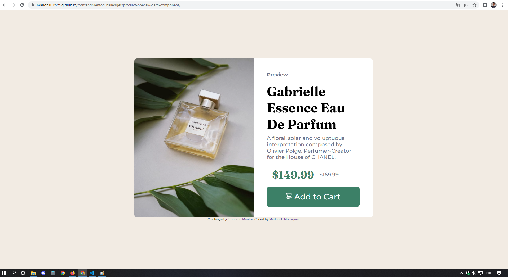
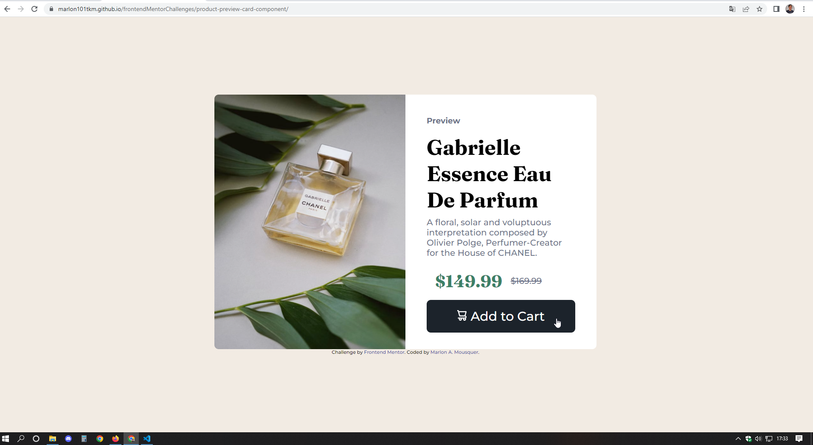

# Frontend Mentor - Product preview card component solution

This is a solution to the [Product preview card component challenge on Frontend Mentor](https://www.frontendmentor.io/challenges/product-preview-card-component-GO7UmttRfa). 

## Table of contents

- [Overview](#overview)
  - [The challenge](#the-challenge)
  - [Screenshot](#screenshot)
  - [Link](#link)
- [My process](#my-process)
  - [Built with](#built-with)
  - [What I learned](#what-i-learned)
  - [Useful resources](#useful-resources)
- [Author](#author)


## Overview

### The challenge

Users should be able to:

- View the optimal layout depending on their device's screen size
- See hover and focus states for interactive elements

### Screenshot

This is the general layout




This is with the hover status active on button



### Link

- Live Site URL: [Product Prevew Card Component](https://marlon101tkm.github.io/frontendMentorChallenges/product-preview-card-component/)

## My process

### Built with

- Semantic HTML5 markup
- CSS custom properties
- Flexbox

### What I learned

The main learning I had were:

in CSS: 

Using the media tag to resize screen elements for different devices
```css
@media only screen and (max-width: 375px) {
  ...
}
```

### Useful resources

- [@media article on mozila docs](https://developer.mozilla.org/pt-BR/docs/Web/CSS/@media) - this article helped me to understand how this CSS tag works, especially in defining the limits for page resizing.

## Author

- Website - [Marlon Almeida Mousquer](https://marlon101tkm.github.io/mini-portfolio/)
- Frontend Mentor - [@marlon101tkm](https://www.frontendmentor.io/profile/marlon101tkm)


